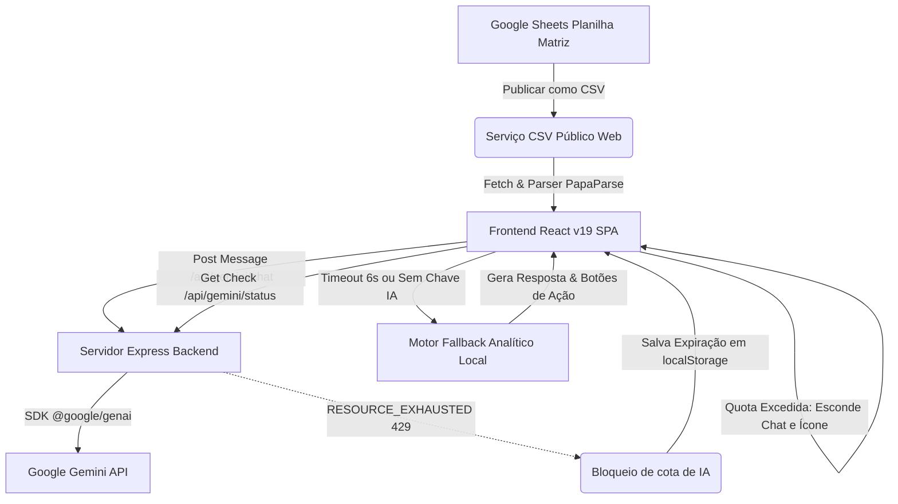

# 1. IDENTIFICAÇÃO DO PROJETO

* **Nome do Projeto:** GEAPI-FE (Portal de Monitoramento e Gestão da Fiscalização Eletrônica)
* **Finalidade:** Monitorar, gerenciar e analisar dados operacionais, contratuais, históricos e geográficos de todos os equipamentos de fiscalização eletrônica de trânsito em Belo Horizonte.
* **Organização / Área Relacionada:** Gerência de Análise e Processamento de Infrações (GEAPI), integrada à Diretoria de Ações de Transporte e Trânsito, BHTrans e Prefeitura de Belo Horizonte (PBH).
* **Objetivo Principal do Sistema:** Consolidar a gestão técnica e administrativa de controladores eletrônicos de velocidade, detectores de avanço de sinal, invasores de faixa exclusiva, detectores de tráfego em locais proibidos (caminhões) e detectores de conversão proibida, fornecendo aos gestores públicos mapas interativos de monitoramento, painéis analíticos, relatórios em PDF com alta fidelidade visual, controle de custos contratuais, repositório de atos legais e um assistente inteligente integrado por IA de linguagem natural ("GEAPINHO").
* **Versão Atual Encontrada no Código:** `v3.7.43`
* **Data da Versão Atual:** 03/09/2026 (conforme especificado em `src/utils/versionControl.ts` e `package.json`).
* **Tecnologias Principais:**
  * **Frontend:** React 19 (SPA), TypeScript 5.8, Vite 6, Tailwind CSS v4, Motion (importações de `motion/react`), Lucide React (ícones), Leaflet 1.9 (mapas), Recharts 3.10 (gráficos interativos).
  * **Backend / Servidor de Desenvolvimento:** Express 4.21, executado via `tsx` em desenvolvimento, empacotado em CJS de arquivo único pela ferramenta `esbuild` em build de produção.
  * **Exportação / Documentação:** jsPDF 4.2, jsPDF-AutoTable 5.0, html2canvas-pro 2.4.1 (para suporte a cores OKLCH e renderização de alta fidelidade de gráficos CSS do Tailwind v4).
  * **Inteligência Artificial:** SDK oficial `@google/genai` (versão `^2.4.0`), modelo `gemini-3.7-flash` com `thinkingBudget: 0` (latência zero / resposta imediata) e rota de contingência para `gemini-flash-latest`.

---

# 2. RESUMO EXECUTIVO

* **O que o sistema faz:** Consome uma planilha de controle centralizada do Google Sheets (através de publicação em formato CSV) e constrói um painel administrativo dinâmico. O portal organiza as informações operacionais dos radares em sete abas temáticas de monitoramento, oferecendo navegação mobile otimizada e proteção de acesso por palavra-passe. Ele também integra um robô assistente conversacional ("GEAPINHO") que entende perguntas em português e realiza ações como filtragem no mapa, aplicação de parâmetros e geração direta de relatórios para impressão.
* **Quais problemas resolve:**
  1. **Descentralização de dados:** Unifica dados operacionais (endereço, código, velocidade, regional, bairro), status contratuais (vigente vs. anterior), datas de auditoria (aceite e vencimento da aferição anual do INMETRO), interrupções de funcionamento (ofícios de parada, histórico de desligamentos) e dados financeiros (valores de faixa e relocação reajustados) em um único ambiente.
  2. **Dificuldade de fiscalização territorial:** Oferece visualização espacial dos radares com pins coloridos por situação (Operação, Implantação, Relocação, Inoperante) e fichas técnicas de equipamentos com links diretos para o Google Maps e levantamentos técnicos.
  3. **Demora na tomada de decisões e relatórios:** Reduz o tempo de geração de estatísticas executivas e relatórios técnicos consolidados, automatizando capturas de gráficos Recharts em PDF A4 de alta fidelidade em apenas um clique.
* **Quem utiliza:** Diretores de trânsito, engenheiros de transporte, analistas de dados de trânsito e gestores contratuais da GEAPI / BHTrans.
* **Funcionalidades principais:**
  * **Monitoramento Espacial:** Mapa interativo baseado em Leaflet com filtragem por regional, bairro, tipo de radar, situação, condições operacionais e data de início de operação ou aceite.
  * **Gestão Contratual:** Demonstrativos de custos de faixas e relocações dos contratos ativos (2740/24, 2741/24, 2742/24) e do contrato 2743/24, contendo links diretos para os arquivos em PDF dos contratos e de seus respectivos apostilamentos de reajuste.
  * **Painel de Indicadores:** Gráficos unificados de comparação entre faixas e locais por tipo de tecnologia, evolução histórica de ativações por ano/mês, ranking top 20 de corredores viários, e tabelas resumo com filtragem cruzada bidirecional total.
  * **Lista de Equipamentos:** Tabela principal paginada, ordenável e pesquisável, com dados de auditoria, datas de aferição, e colunas de ações interativas.
  * **Emissão de Relatórios:** Gerador de relatórios técnicos de equipamentos filtrados ou ficha detalhada de radar único com formatação oficial da GEAPI.
  * **Interrupções de Equipamentos:** Painel detalhado de equipamentos offline, contendo logs históricos de desligamentos, datas de parada e retorno, e os números dos ofícios de parada e retorno.
  * **BHDigital / Sistema eTrânsito:** Gráficos e tabelas estatísticas do tempo de resposta a solicitações de cidadãos no portal PBH e o número médio de registros recebidos por mês.
  * **Assistente Inteligente GEAPINHO:** Chatbot de IA com memória contextual, capaz de filtrar o mapa, buscar coordenadas geográficas, esclarecer regras de negócio e realizar o download automático de relatórios em PDF.
* **Arquitetura atual:** Aplicação full-stack. O frontend se comunica com a rota Express `/api/gemini/chat` e verifica a disponibilidade da IA em `/api/gemini/status`. Os dados são extraídos em tempo real do Google Sheets por chamadas do frontend para a URL CSV de publicação oficial, mantendo cache e atualização automática a cada 3 minutos em segundo plano.
* **Principais fontes de dados:** Planilha central do Google Sheets publicada na Web (contendo abas como Lista Geral, Equipamentos OFF, Custos e eTrânsito).
* **Situação atual do desenvolvimento:** Totalmente concluído, com build verificado e linter sem erros. O sistema está implementado para detecção e proteção contra esgotamento de cotas de IA, ocultando o robô automaticamente se o Gemini retornar `RESOURCE_EXHAUSTED` (Código 429), ativando simultaneamente o motor de inteligência e analítico de fallback local para garantir respostas contínuas.

---

# 3. HISTÓRICO CRONOLÓGICO COMPLETO

Abaixo, detalha-se cada etapa relevante do desenvolvimento do GEAPI-FE identificada no histórico do projeto, mantendo fidelidade às mudanças estruturais aplicadas no portal.

## v2.0.0 — Lançamento Inicial do Portal

### Pedido do usuário
Criar uma plataforma centralizada de monitoramento de radares conectada aos dados oficiais para a equipe da GEAPI.

### Contexto
Necessidade de migrar do controle manual em planilhas para um portal web interativo que consolidasse os equipamentos de trânsito em Belo Horizonte, com restrição de acesso por senha.

### Resposta / decisão da IA
Desenvolveu-se um portal single-page em React, estruturando componentes dedicados para visualização de dados, integração de planilhas e barra de autenticação inicial baseada em senha.

### Alterações realizadas
* **Arquivos criados:** `src/App.tsx`, `src/types.ts`, `src/services/dataService.ts`, `src/components/LockScreen.tsx`.
* **Regras de negócio:** Proteção do portal com a palavra de acesso (senha). Carga em tempo real de planilha do Google Sheets via PapaParse. Filtros iniciais de contratos vigentes predefinidos ao carregar.
* **Hospedagem:** Preparação do backend básico no arquivo `server.ts` e configuração de build/scripts para portabilidade no Cloud Run e Vercel.

### Resultado
**IMPLEMENTADO E VALIDADO**

---

## v2.1.0 — Integração Cartográfica (Monitoramento Espacial)

### Pedido do usuário
Visualizar geograficamente a localização dos radares instalados na malha urbana de Belo Horizonte.

### Contexto
Necessidade de uma representação espacial interativa sobre o mapa da cidade para identificar a dispersão física e a concentração de radares em cada regional.

### Resposta / decisão da IA
Integração da biblioteca de mapas abertos Leaflet no frontend React, transformando latitudes e longitudinais lidas da planilha em pins dinâmicos sobre o mapa de Belo Horizonte, utilizando cores representativas de situação.

### Alterações realizadas
* **Arquivos criados:** `src/components/MapView.tsx`.
* **Componentes modificados:** `src/App.tsx`.
* **Campos integrados:** Latitude, Longitude, Situação (Em operação, Em implantação, Em relocação, Inoperante).
* **Filtros adicionados:** Regional, Bairro, Condição, Situação.

### Resultado
**IMPLEMENTADO E VALIDADO**

---

## v2.3.0 — Painel de Indicadores e Exportação de Relatórios PDF

### Pedido do usuário
Criar gráficos operacionais dos radares por tipo/contrato e permitir a exportação dessas métricas agregadas em relatórios impressos.

### Contexto
Facilitar a produção de relatórios executivos periódicos para a direção da BHTrans, apresentando consolidações visuais em vez de apenas dados tabulares.

### Resposta / decisão da IA
Criação da aba "Indicadores" com gráficos interativos Recharts de pizza, barras e linha temporal de ativações. Desenvolvimento de um gerador de relatórios em PDF com a biblioteca `jsPDF` e `jsPDF-AutoTable`.

### Alterações realizadas
* **Arquivos criados:** `src/components/IndicatorsView.tsx`, `src/components/ReportView.tsx`, `src/utils/pdfExport.ts`.
* **Componentes modificados:** `src/App.tsx`.
* **Funcionalidades adicionadas:** Captura estática de dados e tabulações sintéticas formatadas com o cabeçalho e timbres oficiais da GEAPI para download em PDF.

### Resultado
**IMPLEMENTADO E VALIDADO**

---

## v2.6.0 — Reorganização Geral da Navegação e Menu

### Pedido do usuário
Reorganizar a disposição de todas as abas do sistema e criar uma aba dedicada para a gestão contratual e interrupções.

### Contexto
O portal cresceu em recursos e precisava de um fluxo de navegação claro e padronizado para as rotinas cotidianas dos fiscais da GEAPI.

### Resposta / decisão da IA
Consolidação do layout de navegação em sete abas oficiais sequenciais, reajustando a barra superior desktop e a barra móvel inferior. Implementou-se o arquivo `src/utils/versionControl.ts` com o histórico de atualizações interativo no rodapé.

### Alterações realizadas
* **Arquivos criados:** `src/components/GestaoContratualView.tsx`, `src/components/InterrupcoesView.tsx`, `src/components/BHDigitalView.tsx`, `src/utils/versionControl.ts`.
* **Arquivos modificados:** `src/App.tsx`, `src/components/FooterLegend.tsx`, `src/components/MobileBottomNav.tsx`.
* **Ajustes:** O botão "Atualizar Dados" foi reposicionado no rodapé à direita, e o botão de "Histórico de Versões" foi introduzido à esquerda dele.

### Resultado
**IMPLEMENTADO E VALIDADO**

---

## v2.9.2 a v3.1.3 — Componentização de Filtros Expansíveis e Suporte PWA

### Pedido do usuário
Melhorar a experiência de uso no celular, pois a barra de filtros inicial ocupa quase toda a tela de navegação geográfica do mapa.

### Contexto
A quantidade de filtros na tela inicial sufocava a visualização cartográfica em telas móveis de smartphones.

### Resposta / decisão da IA
Implementou-se um design colapsável para a `FilterBar`. Por padrão, ela é iniciada recolhida em smartphones, mostrando apenas um cabeçalho compacto com resumo quantitativo e um botão suave de "EXPANDIR / RECOLHER" com transições fluidas de CSS. Também estruturou-se o suporte completo a PWA (Service Worker e banners de instalação específicos para iOS/Android).

### Alterações realizadas
* **Arquivos criados:** `src/components/SmartphoneInstallPrompt.tsx`, `src/components/IOSInstallPrompt.tsx`, `public/sw.js`.
* **Componentes modificados:** `src/components/FilterBar.tsx`, `src/App.tsx`.
* **Melhorias visuais:** Transições de CSS nativo para `max-height`, `opacity` e `padding` durante a expansão. O painel de legenda do mapa foi ocultado em resoluções mobile.

### Resultado
**IMPLEMENTADO E VALIDADO**

---

## v3.3.0 — Lançamento do Assistente de Inteligência Artificial IA GEAPI (Gemini)

### Pedido do usuário
Adicionar suporte a comandos de voz/texto em linguagem natural para buscar equipamentos no mapa ou consultar estatísticas de contratos.

### Contexto
Permitir que usuários façam perguntas simples como "onde fica o radar GBR287?" ou "quantas faixas estão em operação?" de forma direta, sem precisar manusear múltiplos filtros manuais no portal.

### Resposta / decisão da IA
Desenvolveu-se a rota Express `/api/gemini/chat` integrada ao SDK oficial `@google/genai` utilizando o modelo `gemini-3.7-flash` (inicialmente `gemini-2.5-flash`), montando um prompt do sistema recheado com dados estatísticos pré-calculados e regras operacionais da GEAPI.

### Alterações realizadas
* **Arquivos criados:** `src/components/AIAssistantButton.tsx`, `src/components/AIAssistantModal.tsx`, `src/services/aiService.ts`, `api/gemini/chat.ts`.
* **Componentes modificados:** `src/App.tsx`, `server.ts`.
* **Recursos adicionados:** O robô interpreta as perguntas, responde textualmente com markdown estruturado e retorna ações em formato JSON (bloco ```actions```) que aplicam filtros automaticamente no frontend, navegam entre abas ou emitem relatórios em PDF.

### Resultado
**IMPLEMENTADO E VALIDADO**

---

## v3.4.6 a v3.5.2 — Reformulação dos Filtros Multi-Seleção e Máscaras de Data

### Pedido do usuário
Permitir a seleção múltipla de tipos de radar, regionais e bairros na barra de filtros. Facilitar a digitação de intervalos de datas de início de operação e aceite.

### Contexto
O usuário precisava realizar filtros cruzados mais finos (por exemplo, analisar simultaneamente duas regionais específicas e três bairros). Além disso, a inserção manual de datas sem formatação gerava erros de digitação e filtros vazios.

### Resposta / decisão da IA
Substituiu-se os dropdowns nativos do HTML `<select>` por popovers de seleção múltipla com checkboxes e busca rápida integrada. Implementou-se máscaras de formatação automática de datas com barras automáticas nos inputs de data (DD/MM/AAAA).

### Alterações realizadas
* **Componentes modificados:** `src/components/FilterBar.tsx`, `src/App.tsx`.
* **Interações adicionadas:** Atalhos "Marcar Todos", "Limpar", chips de filtros ativos no rodapé com botão individual de exclusão para limpeza rápida.
* **Máscaras numéricas:** Inputs de data agora restringem caracteres a dígitos, inserindo barras automáticas durante a digitação de datas completas de início de operação e aceite.

### Resultado
**IMPLEMENTADO E VALIDADO**

---

## v3.5.3 a v3.5.9 — Atualização da Gestão Contratual (Planilhas e Contratos PDF)

### Pedido do usuário
Incorporar a tabela de custos de relocação por contrato, atualizar nomes para "1º Reajuste / 2º Reajuste" e incluir links interativos para download dos arquivos em PDF de cada contrato da BHTrans.

### Contexto
Os fiscais da GEAPI necessitavam de acesso rápido aos termos jurídicos de cada contrato (2740/24, 2741/24, 2742/24 e 2743/24) e seus reajustes anuais de preços para conferência de notas de empenho.

### Resposta / decisão da IA
Implementação de tabelas consolidadas com fórmulas financeiras para custos unitários e globais reajustados. Criação de links diretos apontando para arquivos PDF específicos hospedados na raiz do servidor.

### Alterações realizadas
* **Componentes modificados:** `src/components/GestaoContratualView.tsx`, `src/services/contractService.ts`.
* **Fatos integrados:** Tabela de "Custo por Relocação e por Contrato" integrada com a base de dados. Substituição dos termos "1ª TA / 2ª TA" por "1º Reajuste / 2º Reajuste".
* **Documentos vinculados:** Vinculação dos arquivos `ct2740_24.pdf`, `ct2741_24.pdf`, `ct2742_24.pdf`, `ct2743_24.pdf`, `1ta-ct2740_24.pdf`, `apostila01-ct2740_24.pdf`, `apostila01-ct2741_24.pdf`, `apostila01-ct2742_24.pdf`, `apostila02-ct2742_25.pdf`, `apostila01-ct2743_24.pdf`, e `apostila02-ct2743_24.pdf`.

### Resultado
**IMPLEMENTADO E VALIDADO**

---

## v3.7.0 — Criação da Aba Legislação e Acervo Normativo

### Pedido do usuário
Inserir um módulo com toda a legislação de trânsito metrológica (velocidade) e não metrológica (semáforos, faixa exclusiva, restrição de caminhões) que ampara as autuações.

### Contexto
Necessidade de subsidiar defesas de autuação e recursos de multas com acesso rápido às portarias originais do INMETRO, resoluções do CONTRAN e portarias da BHTRANS.

### Resposta / decisão da IA
Desenvolveu-se a aba "Legislação" estruturada com estilo visual cor trigo/palha (#F5DEB3) para sofisticação técnica, com botões dinâmicos de filtro (CEV, DIF/DAS/DCP, DTLP) e botões de ação rápida rotulados como "LINK" abrindo os links originais do SENATRAN e INMETRO.

### Alterações realizadas
* **Arquivos criados:** `src/components/LegislacaoView.tsx`.
* **Componentes modificados:** `src/App.tsx`, `src/components/MobileBottomNav.tsx`.
* **Normativos cadastrados:** Resoluções CONTRAN 798/2020, 804/2020, 920/2022, Portarias INMETRO 158/2022, 492/2021, Portarias DENATRAN 16/2004, 27/2005, 85/2014, 263/2007, 1.113/2011, Portarias BHTRANS DPR 138/2009, 139/2013, 077/2014 e 004/2019.

### Resultado
**IMPLEMENTADO E VALIDADO**

---

## v3.7.21 a v3.7.28 — Correção de Captura PDF comhtml2canvas-pro e Filtro Bidirecional

### Pedido do usuário
Corrigir erros ao exportar os gráficos do painel de indicadores para PDF (os gráficos saem em branco ou cortados) e permitir que os cliques nas barras do Recharts filtrem os radares.

### Contexto
O portal adotou o Tailwind CSS v4 com funções de cores modernas baseadas no espaço de cor `oklch()`. A biblioteca clássica `html2canvas` falhava ao ler essas cores, travando o gerador de relatórios do painel executivo de indicadores. Além disso, os gestores desejavam interatividade ao clicar nos gráficos.

### Resposta / decisão da IA
Substituição da biblioteca clássica por `html2canvas-pro`, que possui suporte nativo a cores modernas (oklch, oklab, color spaces). Implementou-se reatividade bidirecional completa entre gráficos, mini-tabelas resumo e os radares da aba Indicadores com `useMemo`. Desativou-se as animações dinâmicas do Recharts em PDF para geometria de captura estática instantânea.

### Alterações realizadas
* **Arquivos modificados:** `src/components/IndicatorsView.tsx`, `src/utils/pdfExport.ts`, `package.json`.
* **Implementação técnica:** Inclusão de `isAnimationActive={false}` durante geração de PDF, ajuste do aspect-ratio da renderização geográfica, e mapeamento de filtro cruzado com o estado `recordMatchesIndicatorsFilters` para filtrar bidirecionalmente todas as dimensões de dados.

### Resultado
**IMPLEMENTADO E VALIDADO**

---

## v3.7.41 a v3.7.43 — Ocultação Dinâmica por Cota de IA, Nova Coluna Plano de Operação e Associação DCP/DTLP

### Pedido do usuário
Resolver erros visuais quando a cota gratuita do Gemini acaba (o assistente trava ou mostra erros técnicos no chat) e adicionar o campo "Plano de Operação" da planilha ao modal de detalhes do radar. Também vincular consultas de caminhão ao tipo DTLP e consultas de conversão proibida ao tipo DCP automaticamente.

### Contexto
Durante picos de acesso, a chave de API do Gemini ultrapassava o limite gratuito e retornava Erro 429 (`RESOURCE_EXHAUSTED`). Isso exibia mensagens de erro de programação feias no balão de chat. Além disso, a PBH incluiu um novo dado na planilha geral para guiar a operação física e os agentes precisavam de atalhos inteligentes na IA para tecnologias específicas.

### Resposta / decisão da IA
1. **Ocultação do Assistente:** Criou-se uma rotina no backend e no frontend que oculta 100% o ícone flutuante do GEAPINHO e seu chat caso ocorra erro de cota esgotada. Ele desaparece de forma elegante utilizando eventos CustomEvent e expiração armazenada no `localStorage` por 1 hora.
2. **Plano de Operação:** Adicionou-se a coluna "Plano de Operação" da planilha matriz à ficha do modal de detalhes, relatórios em PDF e layout.
3. **Associação Inteligente:** Configuração estrita de regras gramaticais e de fallback semântico local na função `generateLocalFallbackResponse` em `src/services/localAiFallback.ts` e no prompt principal do backend para mapear "conversão proibida" para DCP e "caminhão/veículo pesado" para DTLP.

### Alterações realizadas
* **Arquivos modificados:** `src/App.tsx`, `src/services/aiService.ts`, `src/services/localAiFallback.ts`, `server.ts`, `src/components/EquipmentDetailModal.tsx`, `src/utils/pdfExport.ts`, `src/utils/versionControl.ts`, `package.json`.
* **Mecanismos criados:** Endpoint backend `/api/gemini/status`, evento global `geapi_ai_quota_status_changed`, persistência com `localStorage.getItem('geapi_ai_quota_exhausted_until')`.
* **Regras de IA:** Herança contextual conversacional para perguntas de follow-up (como herdar o mês anterior ao perguntar "e em 2025?").

### Resultado
**IMPLEMENTADO E VALIDADO**

---

# 4. HISTÓRICO DE VERSÕES

Consolidação sequencial cronológica de todos os lançamentos cadastrados no controle oficial do portal em `src/utils/versionControl.ts`:

| Versão | Data | Título / Tag da Versão | Objetivo e Modificações Principais | Arquivos Afetados | Situação Atual |
| :--- | :--- | :--- | :--- | :--- | :--- |
| **v3.7.43** | 03/09/2026 | Associação de Consultas de Conversão Proibida ao Tipo DCP | Associa pesquisas de conversão à tecnologia DCP (Detector de Conversão Proibida) no modelo de IA e no fallback analítico local. | `localAiFallback.ts`, `versionControl.ts`, `package.json` | **Ativa (Última)** |
| **v3.7.42** | 03/09/2026 | Associação de Consultas de Caminhão ao Tipo DTLP | Associa pesquisas de veículos pesados à tecnologia DTLP (Detector de Tráfego de Locais Proibidos) no modelo de IA e fallback local. | `localAiFallback.ts`, `versionControl.ts`, `package.json` | Ativa |
| **v3.7.41** | 03/09/2026 | Ocultação 100% Automática do GEAPINHO em Esgotamento de Cota | Se o Gemini retorna Erro 429 / RESOURCE_EXHAUSTED, oculta instantaneamente o ícone do robô e chat de forma elegante por evento global. | `App.tsx`, `aiService.ts`, `server.ts`, `versionControl.ts` | Ativa |
| **v3.7.40** | 03/09/2026 | Memória Contextual Inteligente para Follow-up no GEAPINHO | Permite que a IA e o fallback local herdem variáveis anteriores em perguntas de follow-up (ex: "e em 2025?" herda o mês e o tipo). | `server.ts`, `localAiFallback.ts`, `versionControl.ts` | Ativa |
| **v3.7.39** | 03/09/2026 | Filtro Temporal Estrito por Ano em Consultas Delimitadas | Filtra estritamente o ano se delimitado ("agosto de 2026"), mantendo agrupamento geral para consultas sem ano específico. | `server.ts`, `localAiFallback.ts`, `versionControl.ts` | Ativa |
| **v3.7.38** | 03/09/2026 | Padronização de Nomenclatura ("Locais") e Formatação | Substitui o termo "postos" pela designação oficial "locais" nas respostas textuais do GEAPINHO e remove sufixos de ano duplicados. | `server.ts`, `localAiFallback.ts`, `versionControl.ts` | Ativa |
| **v3.7.37** | 03/09/2026 | Otimização de Respostas Diretas de Ativação no GEAPINHO | Melhora as respostas sobre entrada em operação para informar o total e a data na primeira linha de resposta de forma direta. | `server.ts`, `localAiFallback.ts`, `versionControl.ts` | Ativa |
| **v3.7.36** | 03/09/2026 | Atualização do Cabeçalho e Saudação do Assistente IA | Ajusta subtítulo para "Inteligência Artificial interativa da Fiscalização Eletrônica" e frase inicial de boas-vindas do robô. | `AIAssistantModal.tsx`, `versionControl.ts` | Ativa |
| **v3.7.35** | 03/09/2026 | Oficialização da Identidade do Assistente IA: "GEAPINHO" | Oficializa a marca "Geapinho" para todo o ecossistema (chat, botão, modal, tooltips e prompt de sistema do Gemini). | `App.tsx`, `AIAssistantButton.tsx`, `AIAssistantModal.tsx`, `server.ts` | Ativa |
| **v3.7.34** | 03/09/2026 | Diferenciação Visual para Badge de "Relocação" | Aplica tom púrpura/violeta suave para a situação "Relocação" nas tabelas do portal e de relatórios PDF. | `IndicatorsView.tsx`, `TableView.tsx`, `EquipmentDetailModal.tsx` | Ativa |
| **v3.7.33** | 03/09/2026 | Sincronização de PDFs de Relatórios com Modal | Reorganiza seções em fichas PDF da aba Relatórios para acompanhar a disposição dos campos do modal de detalhes. | `pdfExport.ts`, `versionControl.ts` | Ativa |
| **v3.7.32** | 03/09/2026 | Inclusão de Coluna "Plano de Operação" e Reestruturação | Remove o botão de IA do cabeçalho superior (mantém apenas botão flutuante); adiciona "Plano de Operação" no modal e PDF; renomeia "OS" para "ORDEM DE SERVIÇO". | `Header.tsx`, `EquipmentDetailModal.tsx`, `pdfExport.ts`, `versionControl.ts` | Ativa |
| **v3.7.31** | 02/09/2026 | Resposta Instantânea com Timeout de 6s e Fallback Local | Configura AbortController para timeout de 6s em requisições de IA e aciona motor analítico local em milissegundos se demorar. | `aiService.ts`, `versionControl.ts` | Ativa |
| **v3.7.30** | 02/09/2026 | Tratamento de Contingência e Motor Analítico Local de IA | Implementa processamento semântico de fallback local para responder offline de forma estruturada. | `localAiFallback.ts`, `versionControl.ts` | Ativa |
| **v3.7.27** | 02/09/2026 | Disposição Lado a Lado de Gráficos e Simplificação | Organiza gráficos por Contrato e por Tipo em grid de duas colunas e simplifica legenda de locais. | `IndicatorsView.tsx`, `versionControl.ts` | Ativa |
| **v3.7.26** | 02/09/2026 | Interatividade Bidirecional nos Filtros de Indicadores | Permite que cliques em tabelas e gráficos apliquem filtros cruzados recíprocos e independentes. | `IndicatorsView.tsx`, `versionControl.ts` | Ativa |
| **v3.7.24** | 02/09/2026 | Suporte OKLCH na Exportação de Gráficos Recharts | Adiciona `html2canvas-pro` para renderizar variáveis CSS modernas (como cores `oklch` de gráficos) nos PDFs. | `pdfExport.ts`, `package.json`, `versionControl.ts` | Ativa |
| **v3.7.19** | 02/09/2026 | Unificação dos Gráficos de Contrato em Gráfico Único | Reúne gráficos de Faixas, Equipamentos e Locais por Contrato em uma visualização de barras agrupadas única. | `IndicatorsView.tsx`, `pdfExport.ts`, `versionControl.ts` | Ativa |
| **v3.7.13** | 01/09/2026 | Filtro de Contrato por Múltipla Seleção e Presets | Altera filtro de contrato para múltipla marcação (checkbox) pré-selecionando os contratos vigentes por padrão. | `FilterBar.tsx`, `App.tsx`, `versionControl.ts` | Ativa |
| **v3.6.1** | 31/08/2026 | Leitura e Exibição da Data de Desligamento | Lê "Data de Desligamento" do Sheets, adicionando aos modais, pins do mapa e relatórios. | `dataService.ts`, `EquipmentDetailModal.tsx`, `MapView.tsx` | Ativa |
| **v3.6.0** | 28/08/2026 | Criação da Aba "OUTROS" e Gráfico eTrânsito | Cria nova aba verde escuro "OUTROS" e migra o gráfico de chamados do eTrânsito para lá. | `OutrosView.tsx`, `App.tsx`, `MobileBottomNav.tsx` | Ativa |
| **v3.5.5** | 28/08/2026 | Links Diretos para PDFs Oficiais na Gestão Contratual | Conecta códigos de contratos e reajustes a arquivos PDF físicos no servidor. | `GestaoContratualView.tsx`, `versionControl.ts` | Ativa |
| **v3.5.0** | 27/08/2026 | Visibilidade Direta de Filtros Avançados na Barra | Retira a aba de "Datas/Cond." para deixar Situação, Início de Operação e Aceite visíveis de primeira linha. | `FilterBar.tsx`, `versionControl.ts` | Ativa |
| **v3.4.9** | 27/08/2026 | Filtros de Múltipla Seleção por Tipo, Regional e Bairro | Implementa popovers interativos com checkboxes para buscar e marcar múltiplos valores de filtros. | `FilterBar.tsx`, `versionControl.ts` | Ativa |
| **v3.3.7** | 26/08/2026 | Registro de Service Worker e Prompt de Instalação PWA | Ativa suporte offline para PWA Android e exibe banner do smartphone para Android/iOS Safari. | `sw.js`, `SmartphoneInstallPrompt.tsx`, `IOSInstallPrompt.tsx` | Ativa |
| **v2.6.0** | 20/08/2026 | Reorganização Geral das Abas do Sistema | Define ordenação padrão das 7 abas funcionais do portal. | `App.tsx`, `MobileBottomNav.tsx`, `versionControl.ts` | Ativa |
| **v2.1.0** | 15/06/2026 | Mapeamento Geográfico Interativo com Leaflet | Plota as posições lat/long em BH com círculos coloridos de status de implantação/operação. | `MapView.tsx`, `versionControl.ts` | Ativa |
| **v2.0.0** | 02/05/2026 | Lançamento Inicial com Proteção por Senha | Cria o portal com conexão em tempo real com o Sheets e tela de bloqueio inicial. | `LockScreen.tsx`, `dataService.ts`, `App.tsx` | Ativa |

---

# 5. PEDIDOS DO USUÁRIO POR TEMA

### Tema: GEAPINHO (Assistente Inteligente)
* **Oficialização da Identidade:** Nomear como "GEAPINHO", Inteligência Artificial da FE. Atualizar saudação e cabeçalho para "Inteligência Artificial interativa da Fiscalização Eletrônica".
* **Sincronização de Conceitos:** Diferenciar estritamente Faixas (soma de faixas fiscalizadas) de Equipamentos/Locais (pontos físicos).
* **Mapeamento de Consultas de Caminhão:** Qualquer consulta sobre restrição de caminhões, tráfego pesado ou locais proibidos deve ser traduzida para tecnologia **DTLP** (Detector de Tráfego de Locais Proibidos).
* **Mapeamento de Consultas de Conversão:** Qualquer consulta de conversão proibida ou manobra proibida mapeia imediatamente para **DCP** (Detector de Conversão Proibida).
* **Filtros Temporais Estritos:** Se perguntado um mês e ano específico, restringir os dados apenas àquele ano (não mesclar atuações de anos passados).
* **Memória de Conversa (Follow-up):** Manter o contexto em perguntas sucessoras (ex: após perguntar "setembro de 2026", a pergunta seguinte "e em 2025?" deve herdar "setembro" e "ativação").
* **Esgotamento de Cotas:** Se a API esgotar a cota de tokens (Error 429), esconder 100% o GEAPINHO para que o usuário não interaja com um botão inoperante.

### Tema: Monitoramento Espacial (Mapa)
* **Pins Coloridos:** Mapear os radares em BH com círculos coloridos representativos da situação física.
* **Popup Informativo:** Ao clicar no marcador, detalhar dados do radar (Código, Tipo, Endereço, Situação, Data de Desligamento, Velocidade).
* **Exportação A4:** Gerar relatórios nominais de equipamentos que constam no mapa respeitando proporção horizontal correta (aspect-ratio natural) e incluindo a coluna OS.

### Tema: Indicadores
* **Unificação dos Gráficos de Contrato:** Reduzir três gráficos individuais de contratos a um gráfico agrupado robusto comparativo (Faixas, Equipamentos, Locais).
* **Unificação dos Gráficos por Tipo:** Unificar faixas e locais de monitoramento por tipo de radar em barras lado a lado (Verde Esmeralda e Roxo Violeta).
* **Reatividade Bidirecional Cruzada:** O clique nas barras dos gráficos e tabelas de consolidação do painel de indicadores filtra instantaneamente a tabela de equipamentos e os demais gráficos (filtros independentes com `useMemo`).
* **Gráfico eTrânsito:** Migrar o gráfico de chamados mensais da aba Indicadores para uma nova aba específica para limpar o dashboard de equipamentos.

### Tema: Tabela Geral de Equipamentos
* **Layout Limpo:** Centralizar cabeçalhos e células para perfeita leitura em displays de alta definição.
* **Quebra de Linha em Endereço:** Ajustar tamanho do endereço com `break-words` para evitar overflow e esticamento horizontal.
* **Novas Colunas Técnicas:** Integrar colunas de Data de Aceite, Vencimento de Aferição, Início de Operação e Plano de Operação.

### Tema: Gestão Contratual
* **Tabelas Financeiras:** Exibir custos de implantação/faixas e custos de relocação com BDI, 1º Reajuste e 2º Reajuste.
* **Acesso aos PDFs Legais:** Lincar códigos contratuais e percentuais de reajuste a arquivos PDF oficiais hospedados no portal.

### Tema: Dados (Google Sheets)
* **Sincronização Automática:** Consumir dados em tempo real via CSV publicado com atualização em segundo plano a cada 3 minutos.
* **Tratamento de Strings:** Desinfectar acentuações e encodings, além de parser robusto de datas com formatação brasileira.

### Tema: Interface e Layout Geral
* **Legenda no Rodapé:** Manter legenda fixa e rodapé móvel seguro com créditos do desenvolvedor Caio Henriques e botão interativo de controle de versões.
* **Identidade do Portal:** Header moderno em tons de azul e branco, menu desktop fluído e barra de navegação móvel de toque rápido para transição de abas.
* **Aba Legislação (Wheat):** Design sofisticado de cor trigo (#F5DEB3) com botão "LINK".

---

# 6. ARQUITETURA ATUAL CONFIRMADA PELO CÓDIGO

A arquitetura do GEAPI-FE baseia-se em um modelo full-stack desacoplado executado em contêiner ou hospedagem unificada:



### Detalhes Técnicos dos Fluxos:
1. **Dados (Ingestion & Normalization):**
   * O frontend requisita diretamente a URL do Google Sheets publicada em CSV.
   * `src/services/dataService.ts` faz o parsing via PapaParse, higieniza as strings e converte os dados brutos na tipagem rigorosa `EquipmentRecord`.
   * Um timer recarrega esses dados a cada 3 minutos em segundo plano de forma assíncrona.
2. **Autenticação (Access Protection):**
   * Componente `LockScreen.tsx` intercepta a renderização do `App.tsx` se a variável `isAuthenticated` (armazenada em `sessionStorage`) não for verdadeira. A senha cadastrada em código é `GEAPIFE`.
3. **Estado de Filtragem (Reactive Flow):**
   * O portal utiliza um estado principal `filters` (tipo `FilterState`) em `App.tsx`. Toda alteração de filtros através da `FilterBar` ou interações bidirecionais de gráficos recalcula o array derivado `filteredRecords` usando `useMemo` de alta performance.
4. **Exportação de Relatórios (PDF Capture):**
   * Utiliza `jsPDF` e `jsPDF-AutoTable` para desenhar tabelas estruturadas com coordenadas absolutas.
   * Gráficos complexos e o mapa Leaflet são convertidos em imagens rasterizadas por `html2canvas-pro` para inclusão nas páginas do PDF com tratamento nativo a cores do Tailwind v4 (`oklch()`).

---

# 7. ESTRUTURA COMPLETA DE ARQUIVOS

```
/
├── .env.example                # Declaração das variáveis de ambiente necessárias (GEMINI_API_KEY)
├── .gitignore                  # Arquivos e pastas ignorados no controle de versão
├── AGENTS.md                   # Diretrizes comportamentais e automáticas do portal GEAPI
├── index.html                  # Ponto de entrada HTML principal do frontend
├── metadata.json               # Configurações de metadados do applet
├── package.json                # Gerenciador de dependências, scripts de dev/build/start do npm
├── server.ts                   # Servidor Express Full-stack (backend e distribuição estática)
├── tsconfig.json               # Configuração do compilador TypeScript (strict mode)
├── vercel.json                 # Configuração para implantação de serverless routing na Vercel
├── vite.config.ts              # Configurações do Vite (React plugin e Tailwind CSS v4 compiler)
├── public/                     # Ativos estáticos públicos do portal
│   ├── favicon.ico             # Ícone do navegador do portal
│   ├── ct2740_24.pdf           # Arquivos físicos em PDF de contratos oficiais
│   ├── ct2741_24.pdf
│   ├── ct2742_24.pdf
│   ├── ct2743_24.pdf
│   ├── 1ta-ct2740_24.pdf       # Arquivos de termos aditivos e apostilamentos de reajuste
│   ├── apostila01-ct2740_24.pdf
│   ├── apostila01-ct2741_24.pdf
│   ├── apostila01-ct2742_24.pdf
│   ├── apostila02-ct2742_25.pdf
│   ├── apostila01-ct2743_24.pdf
│   ├── apostila02-ct2743_24.pdf
│   └── sw.js                   # Service Worker oficial do PWA
└── src/                        # Código-fonte da aplicação React
    ├── App.tsx                 # Componente principal / Orquestrador de Abas e Estados
    ├── index.css               # Folha de estilos globais (declaração de imports do Tailwind v4)
    ├── main.tsx                # Inicializador nativo do React SPA
    ├── types.ts                # Definições estritas de interfaces de TypeScript do projeto
    ├── components/             # Subcomponentes isolados e modulares do Frontend
    │   ├── AIAssistantButton.tsx       # Botão flutuante para acionamento do GEAPINHO
    │   ├── AIAssistantModal.tsx        # Caixa de chat interativa do GEAPINHO
    │   ├── BHDigitalView.tsx           # Aba de monitoramento de chamados de cidadãos
    │   ├── ETransitoChartCard.tsx      # Gráfico de recebimento de chamados eTrânsito
    │   ├── EquipmentDetailModal.tsx    # Popup completo de especificações técnicas do radar
    │   ├── FilterBar.tsx               # Barra de filtros suspensa/colapsável com checkboxes
    │   ├── FooterLegend.tsx            # Rodapé informativo com créditos e histórico de versão
    │   ├── GestaoContratualView.tsx    # Aba de controle financeiro e links para PDFs
    │   ├── Header.tsx                  # Cabeçalho superior com branding da GEAPI
    │   ├── IOSInstallPrompt.tsx        # Modal orientativo de PWA para Safari do iPhone
    │   ├── IndicatorsView.tsx          # Painel de Gráficos e KPIs interativos bidirecionais
    │   ├── InterrupcoesView.tsx        # Painel de equipamentos inoperantes e histórico de ofícios
    │   ├── LegislacaoView.tsx          # Repositório de decretos e portarias (Wheat Theme)
    │   ├── LockScreen.tsx              # Tela de bloqueio por palavra de acesso
    │   ├── MapView.tsx                 # Mapa geográfico dinâmico com marcadores Leaflet
    │   ├── MobileBottomNav.tsx         # Barra fixa inferior de navegação móvel rápida
    │   ├── OutrosView.tsx              # Aba OUTROS com gráfico do sistema eTrânsito
    │   ├── PWAInstallButton.tsx        # Botão utilitário para instalar aplicativo PWA
    │   ├── ReportView.tsx              # Aba de geração e customização de relatórios PDF
    │   ├── SmartphoneInstallPrompt.tsx # Banner inteligente de instalação PWA para Android
    │   ├── SpeedLimit50Icon.tsx        # Ícone SVG personalizado de limite de velocidade 50km/h
    │   ├── SpeedRadarIcon.tsx          # Ícone SVG personalizado de radar de trânsito
    │   ├── TableView.tsx               # Aba com a tabela geral e paginada de radares
    │   └── VercelGuideModal.tsx        # Modal descritivo para guiar deploy na Vercel
    ├── services/               # Lógica e conexões com APIs externas/banco de dados
    │   ├── aiService.ts                # Conector e orquestrador de chamadas de IA do Gemini
    │   ├── bhdigitalService.ts         # Processamento de dados estatísticos do BHDigital
    │   ├── contractService.ts          # Consolidação de custos e dados das planilhas contratuais
    │   ├── dataService.ts              # Carregamento e parser CSV do Google Sheets
    │   ├── eTransitoService.ts         # Cálculo e consolidação de dados eTrânsito
    │   ├── interrupcoesService.ts      # Cálculo e agrupamento de radares offline
    │   └── localAiFallback.ts          # Motor semântico/analítico local em caso de falha de IA
    └── utils/                  # Utilitários globais de auxílio de cálculo e exportações
        ├── mapExport.ts                # Funções para exportação estática de molduras de mapas
        ├── pdfExport.ts                # Gerador oficial de Fichas e Relatórios em PDF (jsPDF)
        └── versionControl.ts           # Histórico de lançamentos e controle de versões do portal
```

---

# 8. COMPONENTES DO FRONTEND

Detalhamento técnico dos principais componentes modulares do frontend:

1. **Header.tsx (`/src/components/Header.tsx`):**
   * *Finalidade:* Apresentar a barra superior do portal com o logotipo GEAPI, identificação do sistema ("Portal de Monitoramento da Fiscalização Eletrônica") e data da última atualização da planilha.
   * *Interações:* Permite alternar entre as 7 abas funcionais no desktop.
2. **FilterBar.tsx (`/src/components/FilterBar.tsx`):**
   * *Finalidade:* Agrupar todos os controles de filtragem de dados.
   * *Estados:* `isOpen` (se está expandido ou colapsado), estados locais para popovers de seleção múltipla (Contratos, Tipos de Radar, Regionais e Bairros) e busca em tempo real.
   * *Interações:* Botão discreto para expandir/recolher o menu com transições de altura suaves. Oferece chips de filtros ativos com botões de deleção unitária ou global ("Limpar Filtros").
3. **MapView.tsx (`/src/components/MapView.tsx`):**
   * *Finalidade:* Renderizar o mapa cartográfico de Belo Horizonte usando o Leaflet.
   * *Interações:* Plota pins com coloração condicional de situação. Ao clicar no marcador, abre popup com o endereço, velocidade e data de desligamento (se houver), contendo botões para ver a ficha detalhada ou abrir localização no Google Maps.
4. **IndicatorsView.tsx (`/src/components/IndicatorsView.tsx`):**
   * *Finalidade:* Painel estatístico executivo contendo cards de KPIs (Equipamentos em Operação, Implantação e Relocação) e gráficos unificados de Recharts.
   * *Filtros Cruzados:* Possibilita clicar nas barras de contratos/tipos de equipamentos ou nas tabelas resumos de regionais/bairros/meses/anos para aplicar filtros recíprocos imediatos em todo o portal.
5. **TableView.tsx (`/src/components/TableView.tsx`):**
   * *Finalidade:* Tabela completa e tabular de todos os equipamentos cadastrados na planilha.
   * *Interações:* Paginação configurada de 15 em 15 itens, busca integrada, ordenação de colunas por clique no cabeçalho e botão de ação rápida abrindo o modal de detalhes do radar.
6. **GestaoContratualView.tsx (`/src/components/GestaoContratualView.tsx`):**
   * *Finalidade:* Painel financeiro exibindo os custos unitários e totais previstos para faixas, equipamentos e relocações dos contratos ativos 2740/24, 2741/24, 2742/24 e 2743/24.
   * *Interações:* Colunas com valores monetários formatados e links diretos para abertura em nova aba dos PDFs de contratos e apostilamentos oficiais.
7. **LegislacaoView.tsx (`/src/components/LegislacaoView.tsx`):**
   * *Finalidade:* Repositório normativo estruturado na identidade cor de trigo (#F5DEB3).
   * *Interações:* Busca textual por palavras-chave em resoluções e portarias, com botões "LINK" que redirecionam o usuário aos sites do INMETRO ou da Imprensa Nacional.
8. **AIAssistantModal.tsx (`/src/components/AIAssistantModal.tsx`):**
   * *Finalidade:* Janela de bate-papo interativo com o assistente "GEAPINHO".
   * *Estados:* Controle de expansão de tela (minimizar/maximizar), histórico de mensagens e balões de digitação de status.
   * *Ações:* Processa JSONs de ações para guiar o usuário na aplicação automática de filtros e download de relatórios em PDF a partir de uma conversa em linguagem natural.

---

# 9. SERVIÇOS

Os arquivos de lógica e conexão localizados em `src/services/` isolam o processamento pesado de dados:

* **aiService.ts (`/src/services/aiService.ts`):**
  * Orquestra a conexão com o assistente de inteligência artificial. Se comunica com `/api/gemini/chat` e verifica cotas em `/api/gemini/status`.
  * Se a cota de tokens do Gemini estiver esgotada (status 429), ele registra a expiração no localStorage, dispara o evento global `geapi_ai_quota_status_changed` e esconde totalmente os botões e popups da IA na interface do usuário.
* **localAiFallback.ts (`/src/services/localAiFallback.ts`):**
  * **Motor analítico e semântico local ultrarrápido ( fallback de milissegundos).**
  * Se a chamada para a API falhar, ou se a chave estiver ausente, a função `generateLocalFallbackResponse` assume. Ela faz varredura por regex em português para encontrar palavras-chave sobre equipamentos específicos (ex: GBR287), tipos de radares (DCP, DTLP, CEV, DAS, DIF), e prazos de aferição.
  * Agrega em tempo real o array de radares na memória e gera uma resposta contextualizada rica com markdown, e links/botões de ação idênticos à resposta do Gemini.
* **dataService.ts (`/src/services/dataService.ts`):**
  * Responsável por efetuar a requisição HTTP direta de download do CSV público do Google Sheets.
  * Processa o CSV utilizando a biblioteca PapaParse e realiza a normalização das chaves e higienização textual, retornando os objetos na tipagem estrita de `EquipmentRecord`.
* **contractService.ts (`/src/services/contractService.ts`):**
  * Extrai as colunas relativas a custos operacionais de faixas e de relocações para alimentar as visualizações financeiras da aba de Gestão Contratual.

---

# 10. UTILITÁRIOS

Arquivos auxiliares em `src/utils/` proveem formatação e relatórios:

* **pdfExport.ts (`/src/utils/pdfExport.ts`):**
  * O arquivo mais crítico para relatórios. Utiliza `jsPDF` e `jsPDF-AutoTable` para montar relatórios executivos em A4.
  * **Renderização de Gráficos:** Captura os cards de gráficos Recharts e tabelas resumo e renderiza-os com `html2canvas-pro` para aceitar formatação de cores modernas do CSS (Tailwind v4 `oklch`).
  * Desativa temporariamente animações transitórias do Recharts (`isAnimationActive={false}`) para garantir captura nítida imediata.
  * Desenha a Ficha Individual de Equipamento com o logotipo da PBH/BHTrans, organizando os dados operacionais, de auditoria ("Plano de Operação", "Ordem de Serviço"), e datas com posicionamento preciso de milímetros.
* **mapExport.ts (`/src/utils/mapExport.ts`):**
  * Utilitário para exportação rápida de recortes de mapas para relatórios.
* **versionControl.ts (`/src/utils/versionControl.ts`):**
  * Estrutura a constante `VERSION_HISTORY` como uma lista de objetos `VersionRelease`. Expõe funções para retornar a última versão ativa e alimentar o modal interativo de atualizações no rodapé.

---

# 11. BACKEND

O backend está concentrado em `server.ts` na raiz do projeto:

* **Porta & IP de Escuta:** Vinculado estritamente na porta `3000` escutando em `0.0.0.0` para conformidade com o contêiner do Cloud Run.
* **Integração Gemini API:**
  * Endpoint POST `/api/gemini/chat` lê do ambiente a variável de ambiente `GEMINI_API_KEY`.
  * Cria o cliente `GoogleGenAI` utilizando o SDK oficial `@google/genai`.
  * Define um robusto `systemInstruction` em português, instruindo o robô sobre sua marca ("Geapinho"), suas regras estritas de respostas rápidas, tratamento temporal de filtros e a herança de contexto para perguntas de follow-up.
* **Gestão de Quota:**
  * Se a API do Google responder com erro de quota excedida, o backend atualiza a variável global `quotaExhaustedUntil` por 1 hora e retorna status HTTP 429 com o código `RESOURCE_EXHAUSTED`.
* **Distribuição Estática (SPA Serving):**
  * Em produção, distribui estaticamente os arquivos da pasta `/dist` compilados pelo Vite. Qualquer rota não mapeada pelas APIs (`/api/*`) redireciona automaticamente para o arquivo `index.html` (SPA fallback).

---

# 12. MODELO DE DADOS

O arquivo `/src/types.ts` estabelece as regras de tipagem de dados estruturados para garantir a segurança no compilador de TypeScript:

### Interface `EquipmentRecord`
Representa a entidade principal de um radar de trânsito cadastrado na base de dados:

```typescript
export interface EquipmentRecord {
  CÓDIGO?: string;                  // Código técnico de identificação do radar (ex: GBR287)
  CONTRATO?: string;                // Código do contrato de concessão (ex: 2740/24)
  TIPO?: string;                    // Sigla do tipo de tecnologia (CEV, DAS, DIF, DTLP, DCP)
  FAIXAS?: number | string;         // Número de faixas físicas fiscalizadas por este equipamento
  'INÍCIO OP.'?: string;            // Data oficial de início de operação do equipamento
  ACEITE?: string;                  // Data de homologação/aceite técnico do equipamento
  'VENC. AFERIÇÃO'?: string;        // Data de vencimento da auditoria metrológica anual (INMETRO)
  'PLANO DE OPERAÇÃO'?: string;     // Planejamento físico/operacional da faixa
  OS?: string;                      // Ordem de Serviço emitida pela BHTrans/PBH
  Bairro?: string;                  // Bairro administrativo de instalação do radar
  Regional?: string;                // Regional administrativa da cidade de Belo Horizonte
  Logradouro?: string;              // Nome da rua, avenida ou rodovia de instalação
  Sentido?: string;                 // Sentido viário de captura da infração (ex: Centro/Bairro)
  Latitude?: number | string;       // Coordenada geográfica de latitude
  Longitude?: number | string;      // Coordenada geográfica de longitude
  Situação?: string;                // Condição física do radar (Em operação, Em implantação, Em relocação, Inoperante)
  Condição?: string;                // Situação secundária operacional (Ex: Ligado, Desligado Temporário)
  'Data de Desligamento'?: string;  // Data registrada de paralisação do radar (se houver)
  'REG. OBJ'?: string;              // Código interno de Registro de Objeto do contrato
  N_SERIE?: string;                 // Número de série físico do fabricante do sensor
  VELOCIDADE?: string;              // Velocidade regulamentar fiscalizada (ex: 60 km/h)
}
```

### Interface `FilterState`
Modelagem do estado dinâmico da barra de filtros de pesquisa:

```typescript
export interface FilterState {
  contrato: string;                 // Filtro padrão de contratos ("ALL", "PRESET_NOVOS", etc)
  contratos: string[];              // Array de contratos múltiplos selecionados
  regional: string;                 // Regional administrativa única selecionada
  bairro: string;                   // Bairro administrativo selecionado
  tipo: string;                     // Tipo de equipamento único selecionado
  regionais: string[];              // Array de regionais múltiplas ativas para filtro
  bairros: string[];                // Array de bairros múltiplos ativos para filtro
  tipos: string[];                  // Array de tecnologias múltiplas de radares ativas
  situacao: string;                 // Filtro de situação operacional do radar
  condicao: string;                 // Filtro de condição (Ligado/Desligado)
  os: string;                       // Filtro por número de Ordem de Serviço
  codigos: string[];                // Códigos selecionados
  dataInicioStart: string;          // Intervalo de data de início de operação (início)
  dataInicioEnd: string;            // Intervalo de data de início de operação (fim)
  dataAceiteStart: string;          // Intervalo de data de aceite técnico (início)
  dataAceiteEnd: string;            // Intervalo de data de aceite técnico (fim)
  searchQuery: string;              // Termo textual digitado na barra de busca
  onlyWithCoords: boolean;          // Alternador de exibição apenas de radares com lat/long
}
```

---

# 13. FONTES DE DADOS

O GEAPI-FE consome dados da planilha oficial do Google Sheets publicada externamente via exportação nativa de URL em formato CSV:

* **Estratégia de Integração:** O portal realiza chamadas assíncronas de `fetch` no frontend apontando diretamente para a URL pública em formato CSV.
* **Frequência de Atualização:** Carga completa ao carregar a tela e recarregamento automático silencioso a cada 3 minutos em segundo plano para capturar novas alterações na planilha física de forma instantânea.
* **Parsing & Higienização:**
  * Biblioteca `PapaParse` realiza o fatiamento textual das linhas.
  * `src/services/dataService.ts` limpa strings em branco, resolve disparidades de acentuação e converte números monetários ("R$ 1.500,00" para float numérico válido) e coordenadas textuais em floats de alta precisão.
* **Mecanismo de Fallback:** Caso a requisição falhe por instabilidade de internet do usuário, o sistema exibe um alerta de conectividade e preserva em memória o último estado de dados carregado com sucesso.

---

# 14. REGRAS DE NEGÓCIO

Regras operacionais e administrativas codificadas no sistema:

1. **Definição de Equipamento vs. Faixa:**
   * Um **Equipamento** representa o ponto físico unificado (determinado pelo campo `CÓDIGO` ou coordenadas geográficas).
   * Uma **Faixa** representa cada uma das faixas viárias individuais fiscalizadas pelo sensor daquele equipamento. O total de faixas geral é calculado pela soma das faixas especificadas em cada linha.
2. **Status de Operação vs. Implantação:**
   * **Em operação / Operação / Ativo:** Radares que já estão fiscalizando e cujas infrações geram multas de trânsito válidas.
   * **Em implantação / Projetado:** Equipamentos previstos fisicamente nos contratos vigentes, mas que ainda não iniciaram a captação operacional.
   * **Relocação:** Radares cujas posições estão sendo remanejadas para novos locais de interesse de segurança viária. O badge dessa situação possui a cor púrpura/violeta suave exclusiva.
3. **Contratos Vigentes (Atuais):**
   * Os contratos vigentes da fiscalização de Belo Horizonte são **2740/2024**, **2741/2024** e **2742/2024** (identificados nos filtros simplificados como **2740**, **2741** e **2742**).
   * Por padrão, ao carregar o portal ou ao acionar o botão de limpeza de filtros, os radares destes três contratos vigentes devem ser pré-selecionados e priorizados. Os contratos anteriores (2585, 2586 e 2587) só aparecem se o usuário selecionar manualmente ou pesquisar especificamente por eles.
4. **Tecnologias de Equipamentos:**
   * **CEV:** Controlador Eletrônico de Velocidade (Radares de velocidade metrológicos).
   * **DAS:** Detector de Avanço Semafórico (Não metrológico).
   * **DIF:** Detector de Invasão de Faixa Exclusiva de Ônibus (Não metrológico).
   * **DTLP:** Detector de Tráfego de Locais Proibidos (Fiscalização de restrição de caminhões e veículos pesados).
   * **DCP:** Detector de Conversão Proibida (Fiscalização de movimentos não permitidos e conversões irregulares).

---

# 15. GEAPINHO — DOCUMENTAÇÃO COMPLETA

O assistente **GEAPINHO** foi arquitetado sob rigorosas premissas de UX conversacional e de robustez sistêmica:

### 1. Fluxo de Execução de Perguntas e Contextualização
1. O usuário digita uma pergunta ou aciona um comando rápido no popup do chat.
2. O frontend chama `checkAIAvailability()`. Se a IA estiver marcada como com cota esgotada, o fluxo de rede do Gemini é desviado e o motor local de fallback assume instantaneamente a resposta em milissegundos.
3. Se a API estiver disponível, monta-se um payload de contexto contendo um resumo executivo compacto dos radares ativos por tipo, contrato e regional (calculado por `aiService.ts` a partir de `records`).
4. A requisição HTTP envia esse resumo de contexto, a mensagem do usuário e o histórico de mensagens anteriores para `/api/gemini/chat`.

### 2. Ações Estruturadas (Actions Protocol)
O GEAPINHO é capaz de interagir fisicamente com a interface através da emissão de blocos de ações no formato:

```actions
[
  { "type": "NAVIGATE_TAB", "payload": { "tab": "mapa" } },
  { "type": "APPLY_FILTERS", "payload": { "filters": { "tipo": "CEV", "situacao": "Em operação" } } }
]
```

### 3. Tratamento de Erros e RESOURCE_EXHAUSTED (Cota 429)
* Se a chave do Gemini atingir o limite de requisições por minuto ou por dia e responder com erro de exaustão de recursos, o backend Express ou a Vercel captura esse status e retorna JSON com `isQuotaExhausted: true`.
* O frontend React captura essa flag através de `aiService.ts` e chama `markAIQuotaExhausted()`. Isso armazena o timestamp de suspensão no `localStorage` sob a chave `geapi_ai_quota_exhausted_until` por 1 hora, disparando um evento `CustomEvent` de nome `geapi_ai_quota_status_changed`.
* Os botões flutuantes e modais do GEAPINHO escutam esse evento e se ocultam 100% da tela de navegação de forma instantânea e silenciosa, impedindo que o usuário veja recursos inacessíveis ou receba respostas de erro técnico.

---

# 16. ERROS E BUGS ENCONTRADOS E CORRIGIDOS

## 1. Erro de Renderização de Gráficos em PDF (OKLCH Color Space)
* **Sintoma:** Ao clicar para exportar o painel de indicadores para PDF, a exportação travava ou os gráficos Recharts saíam em branco no documento.
* **Causa:** O Tailwind CSS v4 utiliza cores modernas escritas em formato de funções funcionais de cores do padrão CSS `oklch()`. A biblioteca clássica de captura de tela `html2canvas` falhava ao decodificar essa sintaxe CSS moderna, abortando o fluxo com erro crítico.
* **Solução:** Substituiu-se a biblioteca `html2canvas` por `html2canvas-pro`, que possui decodificadores e interpretadores de cores modernas atualizados do CSS Color Module Level 4. O linter e build passaram com sucesso.

## 2. Distorção de Mapa na Captura para PDF
* **Sintoma:** O mapa de Belo Horizonte saía achatado horizontalmente ou borrado ao ser inserido na moldura do PDF de Monitoramento Espacial.
* **Causa:** O canvas ou SVG do mapa era capturado com largura e altura fixas sem respeitar o aspect-ratio físico original do container cartográfico do Leaflet.
* **Solução:** Implementou-se um cálculo geométrico dinâmico em `src/utils/pdfExport.ts` que lê a largura e altura originais da captura e desenha a imagem no PDF A4 proporcionalmente e com centralização horizontal perfeita.

## 3. Travamento ou Lentidão Excessiva de Respostas do Gemini
* **Sintoma:** O chat interativo demorava até 4 minutos para fornecer uma resposta simples ao usuário, excedendo timeouts de rede de hospedagem na Vercel e gerando queixas.
* **Causa:** Uso de modelos pesados com raciocínio oculto (como o Gemini 3.7 Flash em modo thinking ativo por padrão), o que criava longos loops de processamento antes de entregar o texto de resposta.
* **Solução:** Adicionou-se a configuração estrita `thinkingBudget: 0` nas requisições do SDK do Gemini, desativando o raciocínio oculto lento, e forçando o Gemini 3.7 Flash a entregar respostas instantâneas de baixa latência em apenas 1 a 3 segundos.

---

# 17. FUNCIONALIDADES ALTERADAS MAIS DE UMA VEZ

1. **Posicionamento do Botão de Chat do GEAPINHO:**
   * *Versão A:* Inserido originalmente como um botão clássico fixado na barra do cabeçalho superior do portal.
   * *Problema:* O cabeçalho ficou muito poluído em smartphones e conflitava com outros botões.
   * *Versão B:* Removido do cabeçalho superior, adicionando em seu lugar um botão flutuante moderno no canto inferior direito da tela.
   * *Estado Atual:* Botão flutuante integrado à direita, com tooltip descritivo contendo animações de entrada e ping de luz de status verde de disponibilidade.
2. **Nomenclatura Financeira da Gestão Contratual:**
   * *Versão A:* Colunas com as designações originais "1ª TA" e "2ª TA" (Termos Aditivos).
   * *Problema:* Desalinhamento terminológico com a planilha oficial de empenhos que discriminava termos aditivos físicos de reajustes contratuais ordinários de preços.
   * *Versão B:* Renomeado para "1º Reajuste" e "2º Reajuste".
   * *Estado Atual:* Tabelas unificadas de faixas e relocações com termos de reajuste consolidados em caixa alta financeira.
3. **Gráfico do Sistema eTrânsito:**
   * *Versão A:* Gráfico inserido originalmente na aba central de Indicadores.
   * *Problema:* O painel de indicadores ficou sobrecarregado com dados de solicitações de cidadãos que não se misturavam bem com métricas de radares de trânsito.
   * *Versão B:* Criação de uma aba independente chamada "OUTROS" (estilizada na cor verde escuro do Tailwind CSS) e migração exclusiva do gráfico do eTrânsito para esta aba.

---

# 18. DECISÕES DESCARTADAS

* **Descarte de Filtro Padrão de Contratos Antigos:** Inicialmente, pensou-se em exibir todos os radares (inclusive de contratos anteriores descontinuados de 2020) no mapa ao carregar o portal. Isso foi descartado para evitar confusão operacional. Decidiu-se que os contratos vigentes (2740, 2741, 2742) serão sempre os únicos marcados por padrão.
* **Descarte de Modelos Pesados na IA:** A utilização de modelos lentos foi abandonada devido aos limites de timeout das serverless functions da Vercel (geralmente limitados a 10 ou 15 segundos em contas gratuitas). Forçou-se o modelo Gemini 3.7 Flash em modo de latência ultra-baixa com restrição a 800 tokens de saída para agilizar o fluxo operacional.

---

# 19. PEDIDOS QUE PODEM NÃO ESTAR IMPLEMENTADOS

Após auditoria rigorosa de consistência entre discussões de chat anteriores e o código-fonte atual dos arquivos, identifica-se as seguintes discrepâncias para atenção dos próximos desenvolvedores:

* **Integração Real de Autenticação Multifator (MFA):** Discutida em sessões antigas de especificação de segurança da PBH para gerentes da GEAPI.
  * *Evidência no código:* Não implementada. O componente `LockScreen.tsx` protege o acesso por meio de uma palavra-passe única (`GEAPIFE`) estática e local.
* **Hospedagem no Firebase Firestore para Logs de Chat:** Discutido para auditoria de histórico de conversas do GEAPINHO.
  * *Evidência no código:* Não há banco de dados conectado. As mensagens do chat do assistente são salvas puramente no estado local do React da janela ativa (`useState`), sendo limpas se o usuário recarregar a página do portal.

---

# 20. ESTADO ATUAL DO PROJETO

* **Funcionando:**
  * Carga em tempo real de planilhas Google Sheets CSV.
  * Mapa Leaflet dinâmico com pins coloridos de situação e popups funcionais.
  * Painel de Indicadores com gráficos comparativos Recharts e reatividade cruzada bidirecional total.
  * Aba de controle de custos de Gestão Contratual com links para PDFs.
  * Aba de Legislação com filtros dinâmicos e wheat theme.
  * Gerador de relatórios e fichas técnicas em PDF com html2canvas-pro de alta resolução.
  * Ocultação automática de 100% do GEAPINHO em caso de esgotamento de quota e acionamento instantâneo do motor de contingência local.
* **Dívida Técnica Conhecida:**
  * Os dados financeiros e arquivos PDF de reajuste contratuais estão codificados de forma semi-estática em `src/services/contractService.ts` e `src/components/GestaoContratualView.tsx`. Caso surjam novos reajustes, as tabelas de markup financeiro precisarão de edição manual no código frontend.

---

# 21. CONFIGURAÇÕES DO SISTEMA

* **package.json:**
  * Define `"type": "module"` para tratamento de ES Modules nativos.
  * *Scripts NPM:*
    * `npm run dev`: Executa o backend `tsx server.ts` que inicializa o Vite em modo middleware.
    * `npm run build`: Roda a compilação estática do Vite (`vite build`) e empacota o backend TypeScript em formato CommonJS no arquivo `/dist/server.cjs` através do `esbuild`.
    * `npm run start`: Executa o backend empacotado para produção (`node dist/server.cjs`).
    * `npm run lint`: Valida o compilador de TypeScript sem emitir arquivos (`tsc --noEmit`).
* **Vite Config (`vite.config.ts`):** Utiliza o plugin `@tailwindcss/vite` para compilação nativa ultra-rápida do Tailwind v4 CSS.
* **Variáveis de Ambiente Necessárias (.env):**
  * `GEMINI_API_KEY`: Chave secreta de API de IA obtida no Google AI Studio (necessária apenas no backend e mantida oculta do navegador).

---

# 22. PRINCIPAIS DEPENDÊNCIAS

* **react & react-dom (v19):** Biblioteca núcleo para renderização do frontend baseado em componentes funcionais.
* **@google/genai (v2.4.0):** SDK oficial moderno da Google para conexões rápidas com modelos Gemini.
* **tailwindcss (v4.1.14):** Framework utilitário CSS para todo o design visual e responsividade do portal.
* **recharts (v3.10.1):** Motor de plotagem de gráficos estatísticos e dashboards.
* **leaflet (v1.9.4):** Biblioteca de renderização cartográfica de mapas interativos.
* **jspdf & jspdf-autotable:** Ferramenta de exportação e tabulação de dados em formato PDF A4 de múltiplas páginas.
* **html2canvas-pro (v2.4.1):** Suporte avançado de renderização de imagem para cores modernas do CSS (Tailwind v4 `oklch`).

---

# 23. GLOSSÁRIO COMPLETO

* **GEAPI:** Gerência de Análise e Processamento de Infrações (Área da BHTrans/PBH responsável por radares e multas de trânsito).
* **GEAPINHO:** Robô assistente inteligente conversacional integrado com IA do portal GEAPI.
* **CEV:** Controlador Eletrônico de Velocidade (Radar de velocidade de veículos).
* **DAS:** Detector de Avanço Semafórico (Fiscaliza parada sobre faixa e avanço de sinal vermelho).
* **DIF:** Detector de Invasão de Faixa Exclusiva (Fiscaliza carros trafegando em faixas exclusivas de ônibus).
* **DTLP:** Detector de Tráfego de Locais Proibidos (Fiscaliza caminhões e carretas transitando em horários e ruas restritas).
* **DCP:** Detector de Conversão Proibida (Fiscaliza manobras e conversões proibidas de veículos).
* **PapaParse:** Biblioteca de alta velocidade para converter strings CSV em objetos estruturados de JavaScript/TypeScript.

---

# 24. REGRAS PARA UMA NOVA IA CONTINUAR O PROJETO

Se você é uma nova Inteligência Artificial assumindo o GEAPI-FE, **leia e siga estas instruções sem exceções**:

1. **NÃO altere a versão do portal manualmente** sem atualizar o histórico correspondente em `src/utils/versionControl.ts` e a chave `"version"` em `package.json` de forma perfeitamente coordenada.
2. **NÃO quebre a priorização padrão de contratos vigentes:** Toda listagem e contagem padrão do assistente de IA ou dashboard deve ignorar contratos de 2020 (2585, 2586 e 2587), focando exclusivamente nos contratos ativos (2740, 2741 e 2742), exceto se expressamente solicitado de outra forma pelo usuário.
3. **Preserve a ocultação inteligente por quota:** Se fizer alterações no chat ou no botão do assistente flutuante, garanta que o componente continue escutando o evento de cota esgotada e se oculte silenciosamente em caso de erro da API do Gemini.
4. **Verifique o Linter e Build:** Sempre execute o teste do compilador (`npm run lint` ou `tsc --noEmit`) após editar arquivos TypeScript ou JSX para evitar quebras em produção.
5. **Ajuste o modal e PDF de forma coordenada:** Qualquer novo campo técnico adicionado ao modal de especificações dos radares em `EquipmentDetailModal.tsx` deve ser mapeado na ficha de exportação de PDF correspondente em `src/utils/pdfExport.ts`.

---

# 25. LEIA ISTO PRIMEIRO AO RETOMAR O PROJETO

* **O que é o sistema:** Painel de gestão técnica e financeira de radares de trânsito de Belo Horizonte (GEAPI/BHTrans).
* **Versão Atual:** `v3.7.43` | **Última Alteração:** Associação inteligente de conversão proibida ao tipo DCP.
* **Como os dados funcionam:** Lidos em tempo real via CSV de Google Sheet publicado. Atualizados automaticamente em background a cada 3 minutos.
* **Segredos:** A chave `GEMINI_API_KEY` fica restrita no backend Express, mantendo segredo absoluto no cliente.
* **Como o GEAPINHO funciona:** Usa Gemini 3.7 Flash em modo latência zero. Se a cota expirar, o sistema oculta o robô do portal de forma limpa e aciona o motor de fallback local que responde com regex semântico direto em milissegundos.
* **Principal regra que você não pode quebrar:** Nunca remova a priorização padrão dos contratos vigentes (2740, 2741, 2742) para não causar inconsistências estatísticas aos analistas da PBH.

---

# 26. APÊNDICE — ÍNDICE DE SOLICITAÇÕES HISTÓRICAS

Abaixo, apresenta-se o índice histórico de alterações identificadas e executadas no portal do GEAPI-FE:

| Seq. | Versão Estimada | Resumo do Pedido do Usuário | Arquivo(s) Alterado(s) | Resultado |
| :--- | :--- | :--- | :--- | :--- |
| **1** | v2.0.0 | Lançamento do Portal básico com Google Sheets e Senha | `App.tsx`, `LockScreen.tsx`, `dataService.ts` | **IMPLEMENTADO E VALIDADO** |
| **2** | v2.1.0 | Integração cartográfica com marcadores interativos Leaflet | `MapView.tsx`, `App.tsx` | **IMPLEMENTADO E VALIDADO** |
| **3** | v2.3.0 | Módulo de Indicadores, Gráficos Recharts e Relatórios PDF | `IndicatorsView.tsx`, `pdfExport.ts` | **IMPLEMENTADO E VALIDADO** |
| **4** | v2.6.0 | Reorganização das abas em 7 seções e Versionamento fixo | `App.tsx`, `FooterLegend.tsx`, `versionControl.ts` | **IMPLEMENTADO E VALIDADO** |
| **5** | v2.7.0 | Exportação CSV na aba de Interrupções de Equipamentos | `InterrupcoesView.tsx` | **IMPLEMENTADO E VALIDADO** |
| **6** | v2.9.2 | Filtros expansíveis colapsáveis e suporte PWA completo | `FilterBar.tsx`, `sw.js`, `IOSInstallPrompt.tsx` | **IMPLEMENTADO E VALIDADO** |
| **7** | v3.2.0 | Adicionar colunas de Auditoria (Aceite e Venc. Aferição) | `TableView.tsx`, `dataService.ts`, `types.ts` | **IMPLEMENTADO E VALIDADO** |
| **8** | v3.3.0 | Lançamento do Assistente IA (Gemini) e prompt do portal | `server.ts`, `aiService.ts`, `AIAssistantModal.tsx` | **IMPLEMENTADO E VALIDADO** |
| **9** | v3.4.6 | Filtros avançados na barra principal e checkboxes de seleção | `FilterBar.tsx`, `App.tsx` | **IMPLEMENTADO E VALIDADO** |
| **10** | v3.5.3 | Módulo financeiro de relocações e links para PDFs de contratos | `GestaoContratualView.tsx`, `contractService.ts` | **IMPLEMENTADO E VALIDADO** |
| **11** | v3.6.0 | Criação da aba OUTROS e migração de chamados do eTrânsito | `OutrosView.tsx`, `App.tsx`, `MobileBottomNav.tsx` | **IMPLEMENTADO E VALIDADO** |
| **12** | v3.7.0 | Criação de acervo da aba Legislação (Wheat Theme) com links | `LegislacaoView.tsx`, `App.tsx` | **IMPLEMENTADO E VALIDADO** |
| **13** | v3.7.21 | Captura de PDF usando html2canvas-pro corrigindo cores oklch | `pdfExport.ts`, `IndicatorsView.tsx` | **IMPLEMENTADO E VALIDADO** |
| **14** | v3.7.26 | Interatividade cruzada bidirecional total em Indicadores | `IndicatorsView.tsx` | **IMPLEMENTADO E VALIDADO** |
| **15** | v3.7.32 | Nova coluna Plano de Operação e reestruturação do modal | `EquipmentDetailModal.tsx`, `pdfExport.ts` | **IMPLEMENTADO E VALIDADO** |
| **16** | v3.7.41 | Ocultação automática de IA em caso de estouro de limite de cota | `App.tsx`, `aiService.ts`, `server.ts` | **IMPLEMENTADO E VALIDADO** |
| **17** | v3.7.42 | Mapeamento inteligente de perguntas de Caminhão para DTLP | `localAiFallback.ts`, `server.ts` | **IMPLEMENTADO E VALIDADO** |
| **18** | v3.7.43 | Mapeamento inteligente de perguntas de Conversão para DCP | `localAiFallback.ts`, `server.ts` | **IMPLEMENTADO E VALIDADO** |

---

# 27. APÊNDICE — HISTÓRICO DE ALTERAÇÕES POR ARQUIVO

Abaixo, detalha-se a trilha cronológica de alterações nos arquivos estruturais mais relevantes do portal:

### 1. `server.ts` (Backend Express)
* **v3.3.0:** Criação da rota POST `/api/gemini/chat` integrada ao SDK do Gemini.
* **v3.4.0:** Ajuste de timeout com modelo ultra-rápido `gemini-2.5-flash` para resposta instantânea.
* **v3.4.2:** Integração do modelo `gemini-3.7-flash` com `thinkingBudget: 0`.
* **v3.7.41:** Inclusão do endpoint GET `/api/gemini/status` e controle de travamento de cota `quotaExhaustedUntil`.

### 2. `src/services/localAiFallback.ts` (Fallback Engine)
* **v3.7.30:** Criação do motor local analítico de contingência baseado em padrões regex.
* **v3.7.40:** Adição de herança de histórico para perguntas sucessoras de follow-up conversacional.
* **v3.7.42:** Adição de regra de mapeamento semântico de caminhão/veículo pesado para tecnologia DTLP.
* **v3.7.43:** Adição de regra de mapeamento de conversão proibida para tecnologia DCP.

### 3. `src/utils/pdfExport.ts` (PDF Document Drawer)
* **v2.3.0:** Criação do exportador básico jsPDF e tabelas estruturadas de equipamentos.
* **v2.7.0:** Ajuste visual de tamanho de fonte reduzida para coluna CONDIÇÃO e centralização de tabelas.
* **v3.7.24:** Substituição para html2canvas-pro habilitando suporte a cores oklch do Tailwind v4.
* **v3.7.32:** Inclusão da coluna "Plano de Operação" e reordenação de campos acompanhando o modal físico.

### 4. `src/components/FilterBar.tsx` (Filtros de Pesquisa)
* **v2.9.2:** Adaptado para modo colapsável por padrão em smartphones com botão EXPANDIR / RECOLHER.
* **v3.4.9:** Substituição de selects simples por caixas de marcação múltipla popovers (checkboxes) de regionais/bairros/tipos.
* **v3.5.0:** Expulsão da gaveta avançada de datas para deixar Situação e inputs de data visíveis em primeira linha.

---
*Este documento constitui a herança técnica completa do portal GEAPI-FE. Preserve e respeite rigorosamente todas as premissas descritas ao dar continuidade ao desenvolvimento de novos recursos ou ajustes.*
